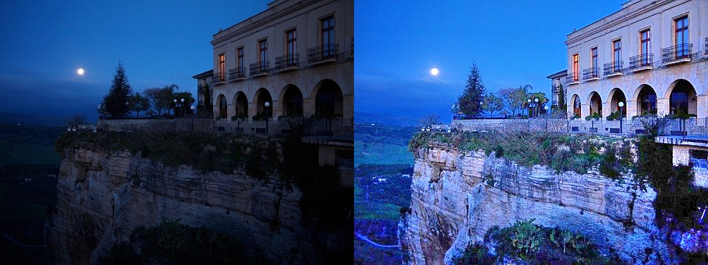
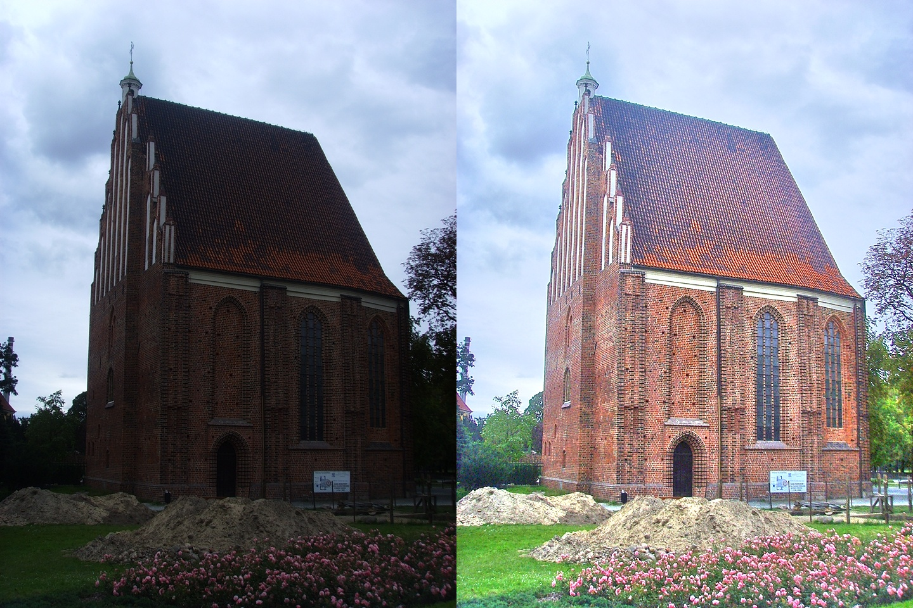
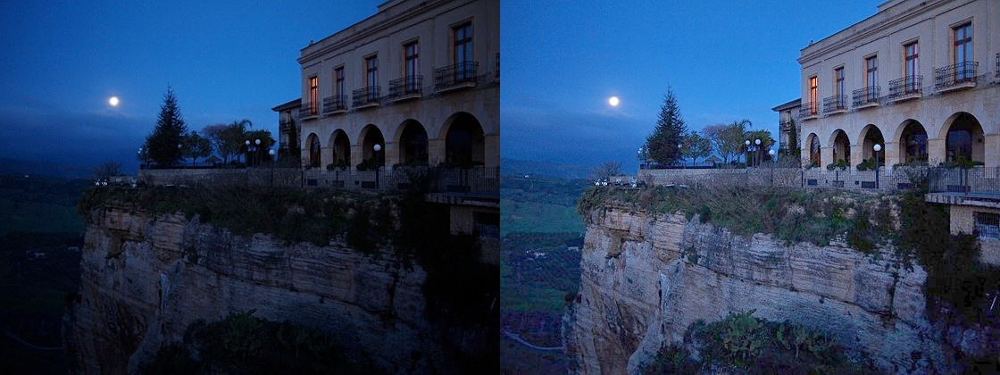
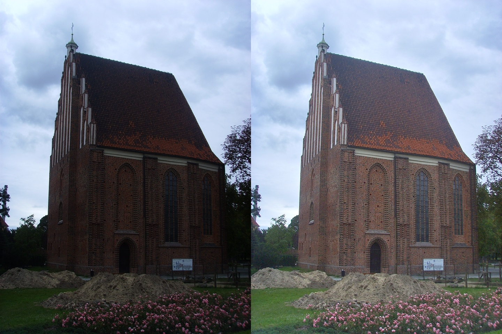

## Fast Speed Low-light-Image-Enhancement
C++ implementation of two low-light image enhancement techniques
* A Bio-Inspired Multi-Exposure Fusion Framework for Low-light Image Enhancement
* LIME: Low-Light Image Enhancement via Illumination Map Estimation


## Requirements
* cmake 
* eigen-3.4
* OpenCV-3.X


## Usage
```
c++
mkdir build
cmake -DFAST_SMOOTH=1 ..
make -j4
./main <input_image>
```

```
python
mkdir build
cmake -DFAST_SMOOTH=1 -DOPEN_PYBIND11=1 ..
make -j4
cd ..
python3 enhancement.py 
```

## time-consuming statistics(mac m1)
  * LIME  8ms  (960*720)
  * BIMEF 30ms  (960*720)

### Results
* LIME
<p align='center'>
  
  
</p>

* BIMEF
<p align='center'>
  
  
</p>


